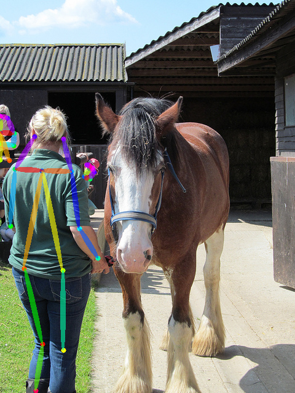

# TorchCV: A PyTorch-Based Framework for Deep Learning in Computer Vision
```
@misc{CV2018,
  author =       {Donny You (youansheng@gmail.com)},
  howpublished = {\url{https://github.com/youansheng/torchcv}},
  year =         {2018}
}
```

This repository provides source code for most deep learning based cv problems. We'll do our best to keep this repository up-to-date.  If you do find a problem about this repository, please raise it as an issue or submit a pull request.


## Implemented Papers

- [Image Classification](https://github.com/youansheng/torchcv/tree/master/methods/cls)
    - VGG: Very Deep Convolutional Networks for Large-Scale Image Recognition
    - ResNet: Deep Residual Learning for Image Recognition
    - DenseNet: Densely Connected Convolutional Networks
    - ShuffleNet: An Extremely Efficient Convolutional Neural Network for Mobile Devices
    - ShuffleNet V2: Practical Guidelines for Ecient CNN Architecture Design

- [Semantic Segmentation](https://github.com/youansheng/torchcv/tree/master/methods/seg)
    - DeepLabV3: Rethinking Atrous Convolution for Semantic Image Segmentation
    - PSPNet: Pyramid Scene Parsing Network
    - DenseASPP: DenseASPP for Semantic Segmentation in Street Scenes
    
- [Object Detection](https://github.com/youansheng/torchcv/tree/master/methods/det)
    - SSD: Single Shot MultiBox Detector
    - Faster R-CNN: Towards Real-Time Object Detection with Region Proposal Networks
    - YOLOv3: An Incremental Improvement
    - FPN: Feature Pyramid Networks for Object Detection

- [Pose Estimation](https://github.com/youansheng/torchcv/tree/master/methods/pose)
    - CPM: Convolutional Pose Machines
    - OpenPose: Realtime Multi-Person 2D Pose Estimation using Part Affinity Fields

- [Instance Segmentation](https://github.com/youansheng/torchcv/tree/master/methods/seg)
    - Mask R-CNN


## QuickStart with TorchCV
Now only support Python3.x, pytorch 1.0.
```bash
pip3 install -r requirements.txt
cd extensions
sh make.sh
```


## Performances with TorchCV
All the performances showed below fully reimplemented the papers' results.

#### Image Classification
- ResNet: Deep Residual Learning for Image Recognition

#### Semantic Segmentation
- Cityscapes (Single Scale Whole Image Test): Base LR 0.01, Crop Size 769

| Model | Backbone | Train | Test | mIOU | BS | Iters | Scripts |
|:--------|:---------|:------|:------|:------|:------|:------|:------|
| [PSPNet]() | [3x3-Res101](https://drive.google.com/open?id=1bUzCKazlh8ElGVYWlABBAb0b0uIqFgtR) | train | val | 78.20 | 8 | 4W | [PSPNet](https://github.com/youansheng/torchcv/blob/master/scripts/seg/cityscapes/run_fs_pspnet_cityscapes_seg.sh) |
| [DeepLabV3]() | [3x3-Res101](https://drive.google.com/open?id=1bUzCKazlh8ElGVYWlABBAb0b0uIqFgtR) | train | val | 79.13 | 8 | 4W | [DeepLabV3](https://github.com/youansheng/torchcv/blob/master/scripts/seg/cityscapes/run_fs_deeplabv3_cityscapes_seg.sh) |

- ADE20K (Single Scale Whole Image Test): Base LR 0.02, Crop Size 520

| Model | Backbone | Train | Test | mIOU | PixelACC | BS | Iters | Scripts |
|:--------|:---------|:------|:------|:------|:------|:------|:------|:------|
| [PSPNet]() | [3x3-Res50](https://drive.google.com/open?id=1zPQLFd9c1yHfkQn5CWBCcEKmjEEqxsWx) | train | val | 41.52 | 80.09 | 16 | 15W | [PSPNet](https://github.com/youansheng/torchcv/blob/master/scripts/seg/ade20k/run_fs_res50_pspnet_ade20k_seg.sh) |
| [DeepLabv3]() | [3x3-Res50](https://drive.google.com/open?id=1zPQLFd9c1yHfkQn5CWBCcEKmjEEqxsWx) | train | val | 42.16 | 80.36 | 16 | 15W | [DeepLabV3](https://github.com/youansheng/torchcv/blob/master/scripts/seg/ade20k/run_fs_res50_deeplabv3_ade20k_seg.sh) |
| [PSPNet]() | [3x3-Res101](https://drive.google.com/open?id=1bUzCKazlh8ElGVYWlABBAb0b0uIqFgtR) | train | val | 43.60 | 81.30 | 16 | 15W | [PSPNet](https://github.com/youansheng/torchcv/blob/master/scripts/seg/ade20k/run_fs_res101_pspnet_ade20k_seg.sh) |
| [DeepLabv3]() | [3x3-Res101](https://drive.google.com/open?id=1bUzCKazlh8ElGVYWlABBAb0b0uIqFgtR) | train | val | 44.13 | 81.42 | 16 | 15W | [DeepLabV3](https://github.com/youansheng/torchcv/blob/master/scripts/seg/ade20k/run_fs_res101_deeplabv3_ade20k_seg.sh) |

#### Object Detection
- Pascal VOC2007/2012 (Single Scale Test): 20 Classes

| Model | Backbone | Train | Test | mAP | BS | Epochs | Scripts |
|:--------|:---------|:------|:------|:------|:------|:------|:------|
| [SSD300](https://drive.google.com/open?id=15J5blVyZq7lqCePh-Q8S2pxim3-f_8LP) | [VGG16](https://drive.google.com/open?id=1nM0UwmqR4lIHzmRWvs71jfP_gAekjuKy) | 07+12_trainval | 07_test | 0.786 | 32 | 235 | [SSD300](https://github.com/youansheng/torchcv/blob/master/scripts/det/voc/run_ssd300_vgg16_voc_det.sh) |
| [SSD512](https://drive.google.com/open?id=1RF5gnqfiyz-EcSFU1OSK7tNuX_VRObVW) | [VGG16](https://drive.google.com/open?id=1nM0UwmqR4lIHzmRWvs71jfP_gAekjuKy) | 07+12_trainval | 07_test | 0.808 | 32 | 235 | [SSD512](https://github.com/youansheng/torchcv/blob/master/scripts/det/voc/run_ssd512_vgg16_voc_det.sh) |
| [Faster R-CNN](https://drive.google.com/open?id=15SfklRiI1McVWEq9EAceznK-9sxXSQR4) | [VGG16](https://drive.google.com/open?id=1ZL9SS9KRzsDQhMe8kyPQ1LHA60wx_Vcj) | 07_trainval | 07_test | 0.706 | 1 | 15 | [Faster R-CNN](https://github.com/youansheng/torchcv/blob/master/scripts/det/voc/run_fr_vgg16_voc_det.sh) |

#### Pose Estimation
- OpenPose: Realtime Multi-Person 2D Pose Estimation using Part Affinity Fields

#### Instance Segmentation
- Mask R-CNN


## DataSets with TorchCV
TorchCV has defined the dataset format of all the tasks which you could check in the subdirs of [datasets](https://github.com/youansheng/torchcv/tree/master/datasets). Following is an example dataset directory trees for training semantic segmentation. You could preprocess the open datasets with the scripts in folder [datasets/seg/preprocess](https://github.com/youansheng/torchcv/tree/master/datasets/seg/preprocess)
```
DataSet
    train
        image
            00001.jpg/png
            00002.jpg/png
            ...
        label
            00001.png
            00002.png
            ...
    val
        image
            00001.jpg/png
            00002.jpg/png
            ...
        label
            00001.png
            00002.png
            ...
```


## Commands with TorchCV

Take PSPNet as an example. ("tag" could be any string, include an empty one.)
- Training
```bash
cd scripts/seg/cityscapes/
bash run_fs_pspnet_cityscapes_seg.sh train tag
```

- Resume Training
```bash
cd scripts/seg/cityscapes/
bash run_fs_pspnet_cityscapes_seg.sh train tag
```

- Validate
```bash
cd scripts/seg/cityscapes/
bash run_fs_pspnet_cityscapes_seg.sh val tag
```

- Testing:
```bash
cd scripts/seg/cityscapes/
bash run_fs_pspnet_cityscapes_seg.sh test tag
```

## Demos with TorchCV

<div align="center">



<p> Example output of <b>VGG19-OpenPose</b></p>


<p> Example output of <b>VGG19-OpenPose</b></p>

</div>

